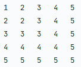

# Patterns

A collection of different kinds of patterns. 

<br>

<a href="pattern_1/main.py">
<h2 align="left">Pattern 1</h2>
</a>


```
n = 5

print("\n".join(["\t".join([str(j + 1) if j >= i else str(i + 1) for j in range(n)]) for i in range(n)]))
```

---