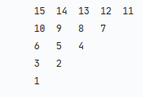
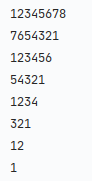

# Patterns

A collection of different kinds of patterns. 

<br>

<a href="pattern_1/main.py">
<h2 align="left">Pattern 1</h2>
</a>


```
n = 5

print("\n".join(["\t".join([str(j + 1) if j >= i else str(i + 1) for j in range(n)]) for i in range(n)]))
```

---

<a href="pattern_2/main.py">
<h2 align="left">Pattern 2</h2>
</a>


```
n = 5
m = (n * (n + 1)) // 2
k = 0

for i in range(n):
    for j in range(n - i):
        print('\t', (m - k), end="")
        k += 1
    print()

```

---

<a href="pattern_3/main.py">
<h2 align="left">Pattern 2</h2>
</a>


```
n = 8

for i in range(n):
    s = ""

    r = range(n - i)

    if i % 2 != 0:
        r = r[::-1]

    for j in r:
        s += str(j + 1)

    print(s)

```

---