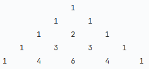
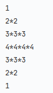

# Patterns

A collection of different kinds of patterns. 

<br>

<a href="pattern_1/main.py">
<h2 align="left">Pattern 1</h2>
</a>


```
n = 5

print("\n".join(["\t".join([str(j + 1) if j >= i else str(i + 1) for j in range(n)]) for i in range(n)]))
```

---

<a href="pattern_2/main.py">
<h2 align="left">Pattern 2</h2>
</a>


```
n = 5
m = (n * (n + 1)) // 2
k = 0

for i in range(n):
    for j in range(n - i):
        print('\t', (m - k), end="")
        k += 1
    print()

```

---

<a href="pattern_3/main.py">
<h2 align="left">Pattern 3</h2>
</a>


```
n = 8

for i in range(n):
    s = ""

    r = range(n - i)

    if i % 2 != 0:
        r = r[::-1]

    for j in r:
        s += str(j + 1)

    print(s)

```

---

<a href="pattern_4/main.py">
<h2 align="left">Pattern 4</h2>
</a>


```
n = 5
l = []

for i in range(n):
    l1 = []
    for j in range(i + 1):
        if 0 < j < i:
            l1.append(l[j - 1] + l[j])
        else:
            l1.append(1)

    l.clear()
    l.extend(l1)
    print("\t" * (n - i), end="")
    print("\t\t".join(list(map(str, l))))
```

---

<a href="pattern_5/main.py">
<h2 align="left">Pattern 5</h2>
</a>


```
l = range(1, 11)
l1 = []
j = 0

for i in range(1, 5):
    j += i
    k = j - i
    l1.append(list(l[k:j]))

l2 = l1[0:2]
l3 = l1[2:]

a = 0
b = 0

for i in range(4):
    if i % 2 == 0:
        print(l2[a])
        a += 1
    else:
        print(l3[b])
        b += 1
```

---

